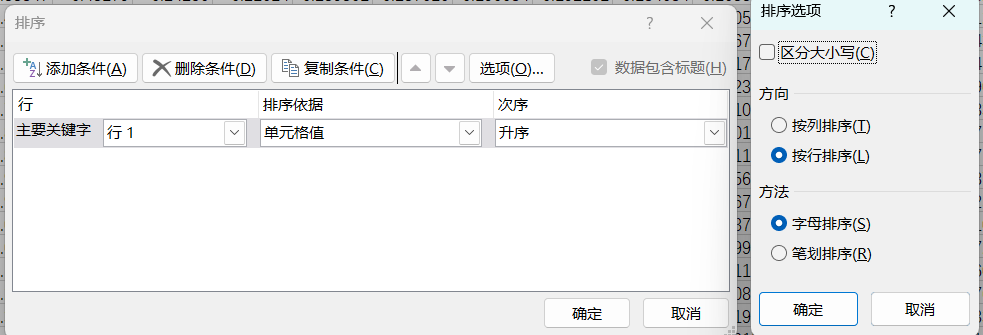
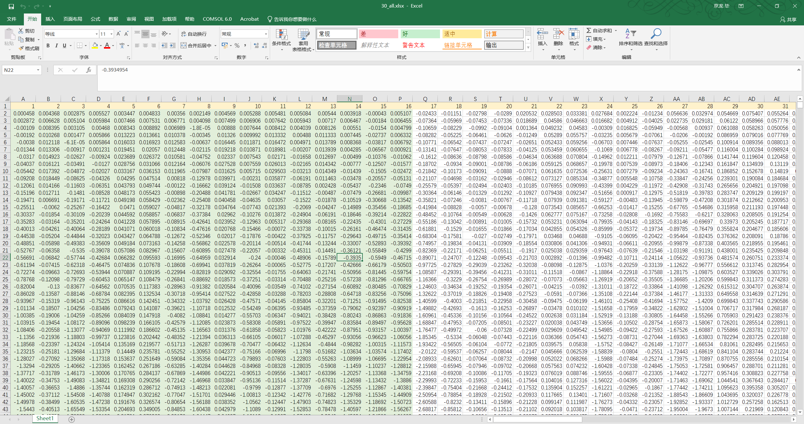
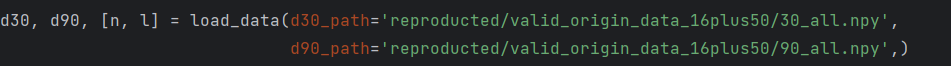

# 1 文件夹到csv
    read_csv.py

# 2 手动调整所需要的数据
- 这么做的原因在于命名时会转换成为日期


复制其中的数据，按照行排序

手动调整其中的先后顺序

变成了两个文件

最终的文件包含一下几个文件：

- **【其中16001组数据：，第2000个数据为1.00038】**

# 3 提取其中的1~8GHz数据
    data_reproduct.py

需要创建一下文件夹路径保存数据

# 4 查找峰值
    dif.py
调整文件堵路路径

调整文件保存路径


结合图像文件等，变黄峰值位置：**shift_result_data.xlsx**

 一般情况下是将数据标黄，再利用 ```extract_yellow_cell.py```将数据提取
 
最后随便找个地方读取数据，转换数据

同时也不要忘记把对应编码数据也做同样转换

最终得到上面这4个比较关键的文件